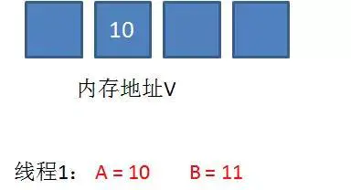
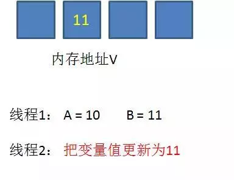
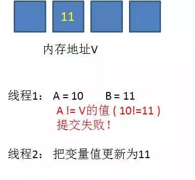
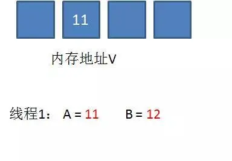
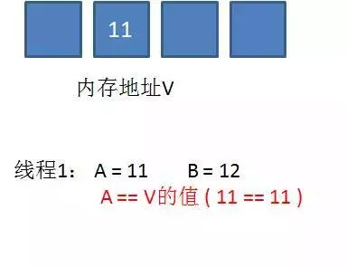
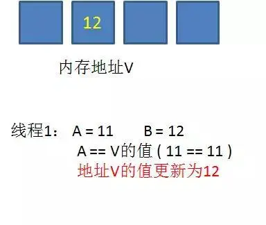

__独占锁__：是一种悲观锁，synchronized就是一种独占锁，会导致其它所有需要锁的线程挂起，等待持有锁的线程释放锁。

__乐观锁__：每次不加锁，假设没有冲突去完成某项操作，如果因为冲突失败就重试，直到成功为止。

CAS操作的就是乐观锁，每次不加锁而是假设没有冲突而去完成某项操作，如果因为冲突失败就重试，直到成功为止。

在进入正题之前，我们先理解下下面的代码:

``` java
private static int count = 0;

public static void main(String[] args) {
    for (int i = 0; i < 2; i++) {
        new Thread(new Runnable() {
            @Override
            public void run() {kkv
                try {
                    Thread.sleep(10);
                } catch (Exception e) {
                    e.printStackTrace();
                }
                //每个线程让count自增100次
                for (int i = 0; i < 100; i++) {
                    count++;
                }
            }
        }).start();
    }

    try{
        Thread.sleep(2000);
    }catch (Exception e){
        e.printStackTrace();
    }
    System.out.println(count);
}
```
请问cout的输出值是否为200？答案是否定的，因为这个程序是线程不安全的，所以造成的结果count值可能小于200;

那么如何改造成线程安全的呢，其实我们可以使用上Synchronized同步锁,我们只需要在count++的位置添加同步锁，代码如下:
``` java
private static int count = 0;

public static void main(String[] args) {
    for (int i = 0; i < 2; i++) {
        new Thread(new Runnable() {
            @Override
            public void run() {
                try {
                    Thread.sleep(10);
                } catch (Exception e) {
                    e.printStackTrace();
                }
                //每个线程让count自增100次
                for (int i = 0; i < 100; i++) {
                    synchronized (ThreadCas.class){
                        count++;
                    }
                }
            }
        }).start();
    }

    try{
        Thread.sleep(2000);
    }catch (Exception e){
        e.printStackTrace();
    }
    System.out.println(count);
}
```
加了同步锁之后，count自增的操作变成了原子性操作，所以最终的输出一定是count=200，代码实现了线程安全。

但是Synchronized虽然确保了线程的安全，但是在性能上却不是最优的，Synchronized关键字会让没有得到锁资源的线程进入BLOCKED状态，而后在争夺到锁资源后恢复为RUNNABLE状态，这个过程中涉及到操作系统用户模式和内核模式的转换，代价比较高。

尽管Java1.6为Synchronized做了优化，增加了从偏向锁到轻量级锁再到重量级锁的过度，但是在最终转变为重量级锁之后，性能仍然较低。

所谓原子操作类，指的是java.util.concurrent.atomic包下，一系列以Atomic开头的包装类。例如AtomicBoolean，AtomicInteger，AtomicLong。它们分别用于Boolean，Integer，Long类型的原子性操作。

``` java
private static AtomicInteger count = new AtomicInteger(0);

public static void main(String[] args) {
    for (int i = 0; i < 2; i++) {
        new Thread(new Runnable() {
            @Override
            public void run() {
                try {
                    Thread.sleep(10);
                } catch (Exception e) {
                    e.printStackTrace();
                }
                //每个线程让count自增100次
                for (int i = 0; i < 100; i++) {
                    count.incrementAndGet();
                }
            }
        }).start();
    }

    try{
        Thread.sleep(2000);
    }catch (Exception e){
        e.printStackTrace();
    }
    System.out.println(count);
}
```
使用AtomicInteger之后，最终的输出结果同样可以保证是200。并且在某些情况下，代码的性能会比Synchronized更好。

而Atomic操作的底层实现正是利用的CAS机制，好的，我们切入到这个博客的正点。

## CAS机制
CAS是英文单词Compare And Swap的缩写，翻译过来就是比较并替换。

CAS机制当中使用了3个基本操作数：内存地址V，旧的预期值A，要修改的新值B。

更新一个变量的时候，只有当变量的预期值A和内存地址V当中的实际值相同时，才会将内存地址V对应的值修改为B。

CAS是英文单词Compare And Swap的缩写，翻译过来就是比较并替换。

CAS机制当中使用了3个基本操作数：内存地址V，旧的预期值A，要修改的新值B。

更新一个变量的时候，只有当变量的预期值A和内存地址V当中的实际值相同时，才会将内存地址V对应的值修改为B。

这样说或许有些抽象，我们来看一个例子：

1.在内存地址V当中，存储着值为10的变量。


2.此时线程1想要把变量的值增加1。对线程1来说，旧的预期值A=10，要修改的新值B=11。



3.在线程1要提交更新之前，另一个线程2抢先一步，把内存地址V中的变量值率先更新成了11。



4.线程1开始提交更新，首先进行A和地址V的实际值比较（Compare），发现A不等于V的实际值，提交失败。



5.线程1重新获取内存地址V的当前值，并重新计算想要修改的新值。此时对线程1来说，A=11，B=12。这个重新尝试的过程被称为自旋。



6.这一次比较幸运，没有其他线程改变地址V的值。线程1进行Compare，发现A和地址V的实际值是相等的。



7.线程1进行SWAP，把地址V的值替换为B，也就是12。



从思想上来说，Synchronized属于悲观锁，悲观地认为程序中的并发情况严重，所以严防死守。CAS属于乐观锁，乐观地认为程序中的并发情况不那么严重，所以让线程不断去尝试更新。

看到上面的解释是不是索然无味，查找了很多资料也没完全弄明白，通过几次验证后，终于明白，最终可以理解成一个无阻塞多线程争抢资源的模型。先上代码
``` java
import java.util.concurrent.atomic.AtomicBoolean;

/**
 * @author hrabbit
 * 2018/07/16.
 */
public class AtomicBooleanTest implements Runnable {

    private static AtomicBoolean flag = new AtomicBoolean(true);

    public static void main(String[] args) {
        AtomicBooleanTest ast = new AtomicBooleanTest();
        Thread thread1 = new Thread(ast);
        Thread thread = new Thread(ast);
        thread1.start();
        thread.start();
    }
    @Override
    public void run() {
        System.out.println("thread:"+Thread.currentThread().getName()+";flag:"+flag.get());
        if (flag.compareAndSet(true,false)){
            System.out.println(Thread.currentThread().getName()+""+flag.get());
            try {
                Thread.sleep(5000);
            } catch (InterruptedException e) {
                e.printStackTrace();
            }
            flag.set(true);
        }else{
            System.out.println("重试机制thread:"+Thread.currentThread().getName()+";flag:"+flag.get());
            try {
                Thread.sleep(500);
            } catch (InterruptedException e) {
                e.printStackTrace();
            }
            run();
        }

    }
}
```

输出的结果:
``` log
thread:Thread-1;flag:true
thread:Thread-0;flag:true
Thread-1false
重试机制thread:Thread-0;flag:false
thread:Thread-0;flag:false
重试机制thread:Thread-0;flag:false
thread:Thread-0;flag:false
重试机制thread:Thread-0;flag:false
thread:Thread-0;flag:false
重试机制thread:Thread-0;flag:false
thread:Thread-0;flag:false
重试机制thread:Thread-0;flag:false
thread:Thread-0;flag:false
重试机制thread:Thread-0;flag:false
thread:Thread-0;flag:false
重试机制thread:Thread-0;flag:false
thread:Thread-0;flag:false
重试机制thread:Thread-0;flag:false
thread:Thread-0;flag:false
重试机制thread:Thread-0;flag:false
thread:Thread-0;flag:false
重试机制thread:Thread-0;flag:false
thread:Thread-0;flag:true
Thread-0false
```
这里无论怎么运行，Thread-1、Thread-0都会执行if=true条件，而且还不会产生线程脏读脏写，这是如何做到的了，这就用到了我们的compareAndSet(boolean expect,boolean update)方法
我们看到当Thread-1在进行操作的时候，Thread一直在进行重试机制，程序原理图:


image

这个图中重最要的是compareAndSet(true,false)方法要拆开成compare(true)方法和Set(false)方法理解，是compare(true)是等于true后，就马上设置共享内存为false，这个时候，其它线程无论怎么走都无法走到只有得到共享内存为true时的程序隔离方法区。

看到这里，这种CAS机制就是完美的吗？这个程序其实存在一个问题，不知道大家注意到没有？

但是这种得不到状态为true时使用递归算法是很耗cpu资源的，所以一般情况下，都会有线程sleep。

## CAS的缺点

1.CPU开销较大

2.不能保证代码块的原子性

3.ABA问题

循环时间长开销很大：
CAS 通常是配合无限循环一起使用的，我们可以看到 getAndAddInt 方法执行时，如果 CAS 失败，会一直进行尝试。如果 CAS 长时间一直不成功，可能会给 CPU 带来很大的开销。

只能保证一个变量的原子操作：
当对一个变量执行操作时，我们可以使用循环 CAS 的方式来保证原子操作，但是对多个变量操作时，CAS 目前无法直接保证操作的原子性。但是我们可以通过以下两种办法来解决：1）使用互斥锁来保证原子性；2）将多个变量封装成对象，通过 AtomicReference 来保证原子性。

什么是ABA问题？ABA问题怎么解决？
如果内存地址V初次读取的值是A，并且在准备赋值的时候检查到它的值仍然为A，那我们就能说它的值没有被其他线程改变过了吗？

如果在这段期间它的值曾经被改成了B，后来又被改回为A，那CAS操作就会误认为它从来没有被改变过。这个漏洞称为CAS操作的“ABA”问题。Java并发包为了解决这个问题，提供了一个带有标记的原子引用类“AtomicStampedReference”，它可以通过控制变量值的版本来保证CAS的正确性。因此，在使用CAS前要考虑清楚“ABA”问题是否会影响程序并发的正确性，如果需要解决ABA问题，改用传统的互斥同步可能会比原子类更高效。

## 参考链接
[Java：CAS(乐观锁)](https://www.jianshu.com/p/ae25eb3cfb5d)
[面试必问的CAS，你懂了吗？](https://blog.csdn.net/v123411739/java/article/details/79561458)
